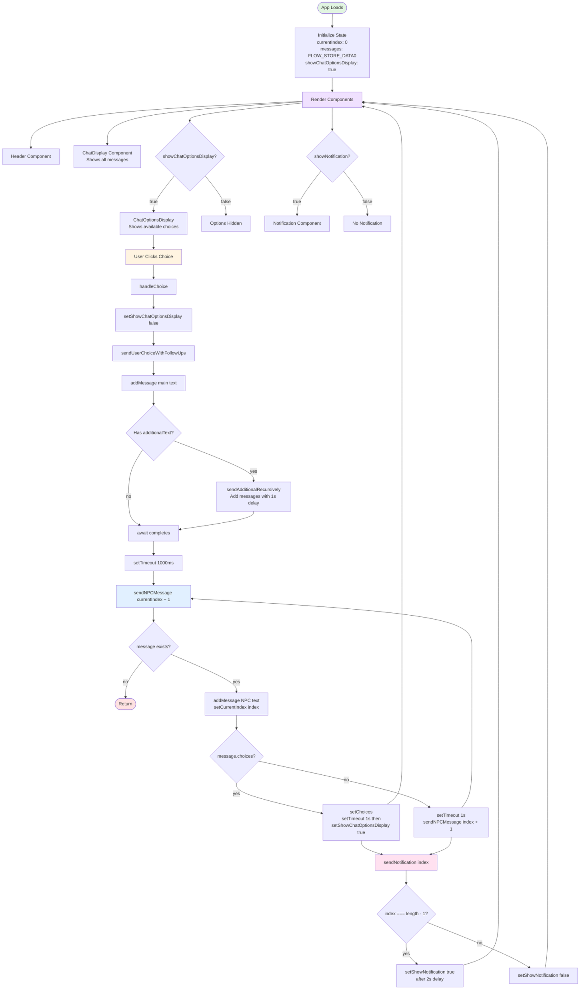

```mermaid
    graph TD
        Start([App Loads]) --> Init[Initialize State<br/>currentIndex: 0<br/>messages: FLOW_STORE_DATA0<br/>showChatOptionsDisplay: true]

        Init --> Display[Render Components]

        Display --> Header[Header Component]
        Display --> ChatDisplay[ChatDisplay Component<br/>Shows all messages]
        Display --> Options{showChatOptionsDisplay?}
        Display --> Notif{showNotification?}

        Options -->|true| ShowOptions[ChatOptionsDisplay<br/>Shows available choices]
        Options -->|false| HideOptions[Options Hidden]

        Notif -->|true| ShowNotif[Notification Component]
        Notif -->|false| HideNotif[No Notification]

        ShowOptions --> UserClick[User Clicks Choice]

        UserClick --> HandleChoice[handleChoice]
        HandleChoice --> HideOpt[setShowChatOptionsDisplay false]
        HideOpt --> SendUser[sendUserChoiceWithFollowUps]

        SendUser --> AddUserMsg[addMessage main text]
        AddUserMsg --> MoreText{Has additionalText?}

        MoreText -->|yes| RecurseUser[sendAdditionalRecursively<br/>Add messages with 1s delay]
        MoreText -->|no| WaitUser[await completes]
        RecurseUser --> WaitUser

        WaitUser --> Delay1s[setTimeout 1000ms]
        Delay1s --> SendNPC[sendNPCMessage currentIndex + 1]

        SendNPC --> CheckMsg{message exists?}
        CheckMsg -->|no| End([Return])
        CheckMsg -->|yes| AddNPCMsg[addMessage NPC text<br/>setCurrentIndex index]

        AddNPCMsg --> HasChoices{message.choices?}

        HasChoices -->|yes| SetChoices[setChoices<br/>setTimeout 1s then<br/>setShowChatOptionsDisplay true]
        HasChoices -->|no| NextNPC[setTimeout 1s<br/>sendNPCMessage index + 1]

        SetChoices --> CheckNotif[sendNotification index]
        NextNPC --> CheckNotif

        CheckNotif --> IsLast{index === length - 1?}
        IsLast -->|yes| ShowNotification[setShowNotification true<br/>after 2s delay]
        IsLast -->|no| HideNotification[setShowNotification false]

        ShowNotification --> Display
        HideNotification --> Display
        SetChoices --> Display
        NextNPC --> SendNPC

        style Start fill:#e1f5e1
        style End fill:#ffe1e1
        style UserClick fill:#fff4e1
        style SendNPC fill:#e1f0ff
        style Display fill:#f0e1ff
        style CheckNotif fill:#ffe1f0
```
